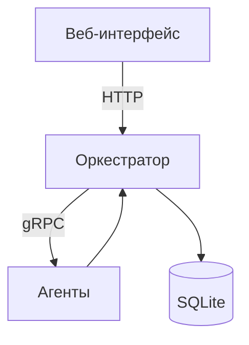

# 🧮 Распределённый вычислитель арифметических выражений

[](https://goreportcard.com/report/github.com/diamsmir03/web-calculator)
[](https://hub.docker.com/r/dimasmir/calc-server)
[](https://github.com/dimasmir03/web-calculator/actions)
[](https://codecov.io/gh/dimasmir03/web-calculator)

## 🚀 Возможности
- 🔢 Вычисление сложных арифметических выражений
- 🔐 Многопользовательский режим с JWT-аутентификацией
- ⚡ Параллельные вычисления с помощью агентов
- 💾 Сохранение состояния в SQLite
- 🔄 Автоматическое восстановление после перезапуска

## 🏗️ Архитектура


## 🛠️ Установка и запуск

### Требования

- Docker 20.10+ или
- Go 1.20+ (для запуска без Docker)
- SQLite3 (для запуска без Docker)

### 1. Запуск с Docker (все ОС)

```bash
# Linux/macOS (bash)
git clone https://github.com/dimasmir03/web-calculator.git
cd web-calculator
docker-compose up --build
```

```powershell
# Windows (PowerShell)
git clone https://github.com/dimasmir03/web-calculator.git
cd web-calculator
docker-compose up --build
```

```cmd
:: Windows (CMD)
git clone https://github.com/dimasmir03/web-calculator.git
cd web-calculator
docker-compose up --build
```

После запуска откройте:

- Веб-интерфейс: [http://localhost:8081](http://localhost:8081)
- Документация API: [http://localhost:8080/swagger](http://localhost:8080/swagger)

### 2. Запуск без Docker

#### Linux/macOS (bash)

```bash
# Сервер (оркестратор)
git clone https://github.com/dimasmir03/web-calculator.git
cd web-calculator/server
go run cmd/server/main.go
```

```bash
# Агент (в новом терминале)
cd ../agent
go run cmd/agent/main.go
```

```bash
# Фронтенд (в новом терминале)
cd web
# Откройте в браузере файл index.html
```

#### Windows (PowerShell)

```powershell
# Сервер
git clone https://github.com/dimasmir03/web-calculator.git
cd web-calculator\server
go run .\cmd\server\main.go
```

```powershell
# Агент (в новом окне)
cd web-calculator\agent
go run .\cmd\agent\main.go
```

```powershell
# Фронтенд (в новом окне)
cd web-calculatorъ\web
# Откройте в браузере файл index.html
```

#### Windows (CMD)

```cmd
:: Сервер
git clone https://github.com/dimasmir03/web-calculator.git
cd web-calculator\server
go run .\cmd\server\main.go
```

```cmd
:: Агент (в новом окне)
cd web-calculator\agent
go run .\cmd\agent\main.go
```

```cmd
:: Фронтенд (в новом окне)
cd web-calculator\web
:: Откройте в браузере файл index.html
```

## 🔒 Аутентификация

### Регистрация

```bash
# Linux/macOS/Windows (PowerShell)
curl -X POST http://localhost:8080/api/v1/register \
  -H "Content-Type: application/json" \
  -d '{"login":"user1", "password":"secret"}'
```

### Получение токена

```bash
curl -X POST http://localhost:8080/api/v1/login \
  -H "Content-Type: application/json" \
  -d '{"login":"user1", "password":"secret"}'
```

## 📚 API Документация

Доступна через Swagger UI: [http://localhost:8080/swagger](http://localhost:8080/swagger)

Основные endpoints:

- POST /register - регистрация
- POST /login - аутентификация
- POST /calculate - добавление выражения
- GET /expressions - список выражений

## ⚙️ Конфигурация

### Оркестратор

```.env
TIME_ADDITION_MS=1000       # Время сложения (мс)
TIME_SUBTRACTION_MS=1000    # Время вычитания (мс)
TIME_MULTIPLICATION_MS=1000 # Время умножения (мс)
TIME_DIVISION_MS=1000       # Время деления (мс)
DB_DSN=calculator.db    # Путь к SQLite
JWT_SECRET=your-secret  # Секрет для JWT
GRPC_PORT=50051         # Порт gRPC
```

### Агент

```.env
SERVER_GRPC=localhost:50051  # Адрес оркестратора
COMPUTING_POWER=4            # Количество ядер
```

## 🧪 Тестирование

### Модульные тесты

```bash
# Linux/macOS
cd server && go test -v ./...
```

```bash
# Windows
cd server && go test -v ./...
```

### Интеграционные тесты

```bash
# Требуется Docker
docker-compose -f docker-compose.test.yml up --build
```

## 🛡️ Особенности работы

- Восстановление состояния: Все выражения сохраняются в БД
- Масштабирование: Запуск нескольких агентов:

```bash
docker-compose up --scale agent=3
```