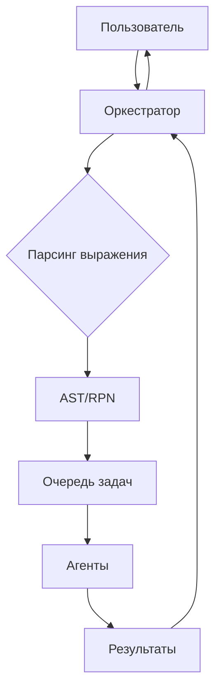

# НЕРУГАЙТЕ Я ВСЁ ИСПРАВЛЮ, напиши issue что готовы дать время на исправления всех недочетов
# СПАСИБО
# @dimajustgo  
# Распределённый вычислитель арифметических выражений

[](https://goreportcard.com/report/github.com/diamsmir03/web-calculator)
[](https://hub.docker.com/r/dimasmir/calc-server)

## Содержание
- [Архитектура системы](#архитектура-системы)
- [Компоненты](#компоненты)
- [Запуск системы](#запуск-системы)
    - [Требования](#требования)
    - [Docker Compose](#docker-compose)
    - [Ручная сборка](#ручная-сборка)
- [API Документация](#api-документация)
- [Статусы выражений](#статусы-выражений)
- [Примеры запросов](#примеры-запросов)
- [Переменные окружения](#переменные-окружения)
- [Особенности работы](#особенности-работы)
- [Технологии](#технологии)

## Архитектура системы


# Компоненты
- 🖥 Оркестратор (Сервер)
  Принимает выражения от пользователей

Преобразует выражения в задачи

Управляет очередью задач

Возвращает статусы вычислений

- ⚡ Агент (Вычислитель)
  Получает задачи из очереди

Выполняет арифметические операции

Работает параллельно в нескольких горутинах

Возвращает результаты на сервер

# Запуск системы
## Требования
Docker и Docker Compose
Или Go 1.24+

## Docker Compose (рекомендуется)

```bash
# 1. Скачайте репозиторий
git clone https://github.com/yourusername/web-calculator.git
cd web-calculator

# 2. Запустите систему
docker-compose up --build
# Сервер будет доступен на http://localhost:8080
# Агенты автоматически подключатся к серверу
```

## Ручная сборка

```bash
# Сервер
cd server
go build -o server ./cmd/server
TIME_ADDITION_MS=1000 ./server

# Агент (в отдельном терминале)
cd agent
go build -o agent ./cmd/agent
SERVER_URL=http://localhost:8080 ./agent
API Документация
Доступна через Swagger UI:
http://localhost:8080/swagger/index.html
```

Postman Collection

| Статус     | Описание               | HTTP Код |
|------------|------------------------|----------|
| pending    | Ожидает выполнения	    | 201      |
| processing | В процессе вычисления  | 200      |
| completed  | Успешно выполнено	     | 200      |
| error      | Ошибка при вычислении	 | 422      |

# Примеры запросов
- Добавить выражение:

```bash
curl -X POST http://localhost:8080/api/v1/calculate \
  -H "Content-Type: application/json" \
  -d '{"expression": "(2+2)*2"}'
```

Ответ:

```json
{
  "id": "550e8400-e29b-41d4-a716-446655440000",
  "status": "pending"
}
```

- Получить статус:

```bash
curl http://localhost:8080/api/v1/expressions/550e8400-e29b-41d4-a716-446655440000
```

- Переменные окружения
- Сервер

```ini
PORT=8080
TIME_ADDITION_MS=1000       # Время сложения (мс)
TIME_SUBTRACTION_MS=1000    # Время вычитания
TIME_MULTIPLICATION_MS=1000 # Время умножения
TIME_DIVISION_MS=1000       # Время деления
```

- Агент

```ini
SERVER_URL=http://host.docker.internal:8080  # URL оркестратора
COMPUTING_POWER=4                           # Количество горутин
TIME_WAIT_MS=1000                           # Задержка при ошибках
```

# Особенности работы
Парсинг выражений: Используется RPN (Обратная Польская Запись) и AST

Параллельные вычисления: Агенты работают независимо друг от друга

Обработка ошибок: Автоматический повтор запросов при сбоях

Масштабирование:

```bash
# Увеличить количество агентов
docker-compose up --scale agent=3
```

# Технологии
- Сервер:
- Go,
- Echo Framework,
- Swagger
- Агент:
- Go Routines,
- HTTP Client
- Парсинг:
- AST,
- RPN
- Деплой:
- Make
- Docker,
- Docker Compose
