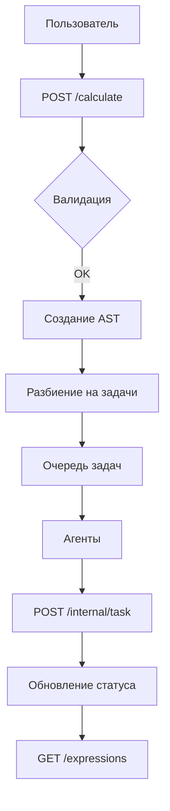

# ВЕБ КАЛЬКУЛЯТОР С РАСПРЕДЕЛЕННЫМИ ВЫЧИСЛЕНИЯМИ

## Оглавление
- [Описание](#описание)
- [Архитектура](#Архитектура)
- [API Документация](#api-документация)
- [Статусы выражений](#статусы-выражений)
- [Запуск](#запуск)
    - [Требования](#требования)
    - [Переменные окружения](#переменные-окружения)
    - [Сборка и запуск](#сборка-и-запуск)
- [Примеры запросов](#примеры-запросов)
- [Технологии](#технологии)

## Описание
Сервер-оркестратор для распределенного вычисления арифметических выражений. Использует RPN (Обратную Польскую Запись) и AST (Абстрактное Синтаксическое Дерево) для парсинка выражений.

## Архитектура

API Документация
Доступна через Swagger UI: http://localhost:8080/swagger/index.html

[Postman Collection](https://app.getpostman.com/join-team?invite_code=9cac2ae36844ef092a1cdc71606cb988f42f99edaf7d3ff684768b7782fee6eb)

Статусы выражений
Статус	Описание
pending	Ожидает выполнения
processing	В процессе вычисления
completed	Успешно выполнено
error	Ошибка при вычислении
Запуск
Требования:   
Go 1.20+  
Docker 20.10+

Переменные окружения
bash
Copy
TIME_ADDITION_MS=1000       # Время сложения (мс)
TIME_SUBTRACTION_MS=1000    # Время вычитания (мс)
TIME_MULTIPLICATION_MS=1000 # Время умножения (мс)
TIME_DIVISION_MS=1000       # Время деления (мс)
PORT=8080                   # Порт сервера
Сборка и запуск
Через Makefile:

bash
Copy
make docker_network  # Создать сеть
make docker_build    # Собрать образ
make docker_run      # Запустить контейнер
Docker Compose:

yaml
Copy
version: '3.8'
services:
  orchestrator:
    image: calc-server
    ports:
      - "8080:8080"
    environment:
      - TIME_ADDITION_MS=1000
      - TIME_SUBTRACTION_MS=1000
Ручной запуск (Linux/Mac):

bash
Copy
go build -o server ./cmd/server
TIME_ADDITION_MS=1000 ./server
Примеры запросов
Добавление выражения:

bash
Copy
curl -X POST http://localhost:8080/api/v1/calculate \
  -H "Content-Type: application/json" \
  -d '{"expression": "2+2*2"}'
Ответ:

json
Copy
{"id": "550e8400-e29b-41d4-a716-446655440000"}
Ошибка:

json
Copy
{
  "error": "Invalid expression",
  "details": "Unexpected character at position 3"
}
Технологии
Echo Framework

Swagger

RPN/AST парсер

Docker

