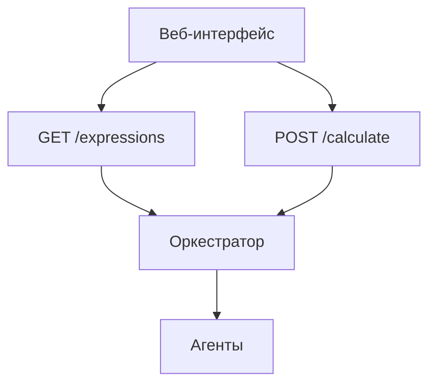

# Веб-интерфейс калькулятора

[](https://developer.mozilla.org/ru/docs/Web/HTML)
[](https://jquery.com/)

## Содержание

- [Функционал](#функционал)
- [Архитектура](#архитектура)
- [Запуск](#запуск)
  - [Через Docker](#через-docker)
  - [Локальный запуск](#локальный-запуск)
- [Конфигурация](#конфигурация)
- [Примеры использования](#примеры-использования)

## Функционал

- Ввод арифметических выражений через форму
- Автоматическое обновление списка выражений
- Визуальная индикация статусов:
  - ⏳ `pending` - желтый
  - ⚙️ `processing` - голубой
  - ✅ `completed` - зеленый
  - ❌ `error` - красный
- Ручное и автоматическое обновление данных

## Архитектура



## Запуск

### Через Docker

```bash
# Собрать образ
docker build -t calc-frontend .

# Запустить контейнер
docker run -p 8081:80 --network calc-net calc-frontend
```

### Локальный запуск

Установите Live Server расширение для VSCode

Откройте index.html через Live Server

В файле app.js замените:

```javascript
const API_BASE_URL = 'http://localhost:8080/api/v1';
Конфигурация
Переменная По умолчанию Описание
API_BASE_URL http://server:8080 URL оркестратора
AUTO_REFRESH_DELAY 2000 Задержка автообновления
```

Примеры использования

```javascript
// Ручной запрос выражений
fetch(`${API_BASE_URL}/expressions`)
  .then(response => response.json())
  .then(data => console.log(data));

// Отправка выражения
fetch(`${API_BASE_URL}/calculate`, {
  method: 'POST',
  body: JSON.stringify({expression: "2+2*2"})
});
```

```markdown
# Распределённый вычислитель выражений

[](https://docs.docker.com/compose/)
[](http://localhost:8080/swagger)

## Содержание
- [Компоненты системы](#компоненты-системы)
- [Полная архитектура](#полная-архитектура)
- [Запуск всей системы](#запуск-всей-системы)
- [Основные эндпоинты](#основные-эндпоинты)
- [Статусы выражений](#статусы-выражений)
- [Демо-доступ](#демо-доступ)
- [Разработка](#разработка)
- [Лицензия](#лицензия)

## Компоненты системы
| Компонент       | Описание                          | Порт  |
|-----------------|-----------------------------------|-------|
| Оркестратор     | Управление задачами и выражениями | 8080  |
| Агент           | Выполнение арифметических операций| -     |
| Веб-интерфейс   | Пользовательский интерфейс        | 8081  |

## Полная архитектура
```mermaid
sequenceDiagram
    participant UI as Веб-интерфейс
    participant Orchestrator
    participant Agent1
    participant Agent2
    
    UI->>Orchestrator: POST /calculate
    Orchestrator->>Agent1: Задача 1
    Orchestrator->>Agent2: Задача 2
    Agent1->>Orchestrator: Результат 1
    Agent2->>Orchestrator: Результат 2
    Orchestrator->>UI: Обновление статуса
Запуск всей системы
bash
Copy
# 1. Клонировать репозиторий
git clone https://github.com/yourusername/web-calculator.git
cd web-calculator

# 2. Запустить все сервисы
docker-compose up --build

# 3. Открыть в браузере:
#    - Интерфейс: http://localhost:8081
#    - Документация: http://localhost:8080/swagger
Основные эндпоинты
Оркестратор
http
Copy
POST /api/v1/calculate     Добавление выражения
GET /api/v1/expressions    Получение всех выражений
GET /api/v1/expressions/:id Получение конкретного выражения
Агент
http
Copy
GET /internal/task         Получение задачи
POST /internal/task        Отправка результата
Статусы выражений
Статус	Иконка	Описание
pending	⏳	Ожидает выполнения
processing	⚙️	В процессе вычисления
completed	✅	Успешно выполнено
error	❌	Ошибка при вычислении
Демо-доступ
Try in Postman

Пример запроса:

bash
Copy
curl -X POST "http://localhost:8080/api/v1/calculate" \
  -H "Content-Type: application/json" \
  -d '{"expression": "(2+2)*2"}'
Разработка
bash
Copy
# Запустить тесты
make test

# Сгенерировать документацию
swag init -g cmd/server/main.go --output docs

# Локальный запуск агента
cd agent && go run ./cmd/agent